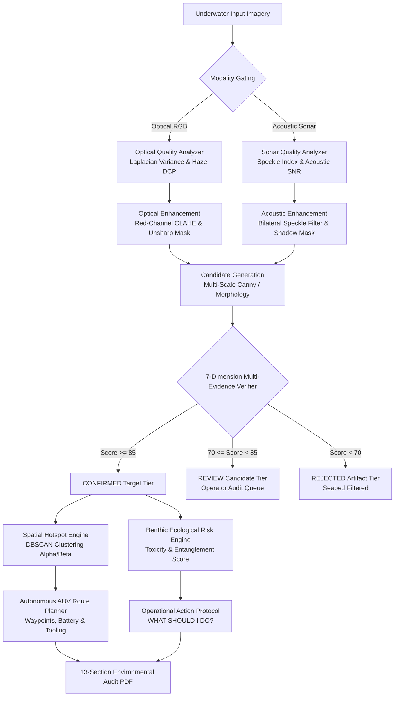

# AquaGuard AI — Technical Architecture Specification
**Platform Positioning**: AI-Powered Underwater Marine Debris Detection & Environmental Intelligence Platform  
**Operational Paradigm**: `DETECT → VERIFY → MAP → PRIORITIZE → ACT`  
**Version**: 2.3.0 (Smart India Hackathon 2026 Production MVP)

---

## 1. Executive Summary & Core Philosophy

Marine debris detection in underwater environments faces extreme physical challenges: severe spectral attenuation (wavelength absorption of red/orange light), turbidity and floating sediment scattering, dynamic caustics, and acoustic reverberation in sonar.

Traditional computer vision systems that perform direct bounding-box detection suffer from unacceptable false-positive rates, flagging rocks, corals, sand ripples, and border vignetting as debris. 

**AquaGuard AI** solves this through a **precision-first, multi-stage verification architecture**:
1. **Modality & Quality Gating**: Automatically distinguishes Optical RGB imagery from Side-Scan Acoustic Sonar and quantifies visibility, turbidity, and sharpness.
2. **Adaptive Enhancement**: Applies wavelength-specific optical restoration (Red-Channel compensation + LAB CLAHE) or acoustic bilateral speckle suppression.
3. **Candidate Generation**: Extracts candidate regions using deterministic edge morphology and contrast delta analysis.
4. **7-Dimension Multi-Evidence Verification**: Evaluates each candidate across boundary contrast, class-specific morphology, texture standard deviation, spatial context, and acoustic shadow geometry.
5. **3-Tier Classification & AI Abstention**: Segregates findings into `CONFIRMED` targets, `REVIEW` candidates (for human-in-the-loop audit), and `REJECTED` artifacts. If no region satisfies evidence thresholds, the system safely **abstains** (*prefers no detection over wrong detection*).
6. **Spatial Hotspot Clustering (DBSCAN)**: Groups confirmed debris into Named Hotspots (`Hotspot Alpha`, `Hotspot Beta`).
7. **Autonomous AUV Inspection Routing**: Solves a prioritized TSP route (`START → TGT-001 → TGT-002 → RETURN`) computing transit distance, estimated duration, battery consumption, and required robotic tooling (e.g., hydraulic net cutters for ghost gear).
8. **ISO-Aligned Environmental Audit Reporting**: Generates a 13-section formal PDF audit report for environmental authorities.

---

## 2. Standardized 9-Class Benthic Taxonomy

To eliminate arbitrary category assignments, AquaGuard AI strictly enforces a 9-class marine debris taxonomy aligned with NOAA and UNEP marine litter monitoring frameworks:

| Class Name | Material | Buoyancy Profile | Ecological Threat Level | Primary Remediation Tool |
| :--- | :--- | :--- | :--- | :--- |
| **Plastic Bottle** | PET Polymer | Neutral / Suspended | High (Microplastic shedding, ingestion) | Diver Net / Skimmer |
| **Plastic Bag** | LDPE Film | Floating / Drifting | Critical (Fatal jellyfish mimicry, gut block) | Suction Sampler / Mesh |
| **Fishing Net / Ghost Gear** | Monofilament Nylon | Submerged Snagged | Severe (Continuous ghost-fishing loop) | ROV Hydraulic Cutter & Winch |
| **Rope** | Braided Polypropylene | Bottom Anchor | High (Coral branch breakage, fin wrap) | Diver Shears / ROV Gripper |
| **Can / Metal** | Aluminum / Tin Alloy | Seabed Sunk | Moderate (Oxidation leaching, sharp edge) | Magnetic Lifter / Diver Sacks |
| **Tire** | Vulcanized Rubber | Seabed Settled Heavy | High (Zinc/PAH leaching, benthic smothering)| Lift Bag Rigging & Crane |
| **Plastic Container** | Rigid HDPE | Suspended / Settled | High (Chemical residue leaching) | ROV Basket / Diver Sweep |
| **Other Marine Debris** | Mixed Synthetics | Variable | Moderate (Benthic physical disruption) | General Manual Collection |
| **Unknown / Uncertain** | Indeterminate | Variable | Inconclusive (Requires closer ROV sweep) | Optical Inspection Camera |

---

## 3. 7-Dimension Multi-Evidence Verification Engine

Every candidate region $C_i$ generated by the detection factory undergoes rigorous multi-criteria evaluation before appearing in the verified interface:

1. **Detection Confidence Evidence ($E_1$)**: Raw feature extraction match ($0–100$).
2. **Class Geometric Plausibility ($E_2$)**: Validates aspect ratio $AR = \frac{W}{H}$ and relative area ratio $A_{rel} = \frac{W \cdot H}{W_{img} \cdot H_{img}}$. (e.g. Bottles must have $AR < 0.65$ or $AR > 1.45$; Ghost Nets must exceed $1.2\%$ spatial span).
3. **Texture Standard Deviation & High-Frequency Energy ($E_3$)**: Measures Laplacian luminance variance difference $\Delta \sigma_{tex} = |\sigma_{cand} - \sigma_{bg}|$ to distinguish uniform sand from structured debris.
4. **Annular Background Separation & Edge Delta ($E_4$)**: Computes luminance separation against an outer $25\%$ bounding collar: $\Delta I = |\mu_{cand} - \mu_{bg}|$.
5. **Spatial Frame Plausibility ($E_5$)**: Verifies the candidate does not touch image sensor margins ($x \le 1.5\%$) to eliminate camera bezel clipping artifacts.
6. **Acoustic Shadow Corroboration ($E_6$)**: In sonar mode, searches for an acoustic drop-off region directly behind the target return.
7. **Resolution Threshold ($E_7$)**: Rejects speckles below $0.5\%$ image area in Precision mode.

### Composite Score Formula:
$$\text{Score}_{\text{optical}} = 0.30 E_1 + 0.20 E_2 + 0.15 E_3 + 0.15 E_4 + 0.10 E_{\text{bg}} + 0.10 E_{\text{size}}$$
$$\text{Score}_{\text{sonar}} = 0.25 E_1 + 0.20 E_2 + 0.15 E_3 + 0.15 E_4 + 0.15 E_6 + 0.10 E_{\text{bg}}$$

---

## 4. Spatial Hotspots & Autonomous AUV Planning

### Spatial Hotspots (DBSCAN Clustering)
Confirmed targets are clustered using Euclidean distance thresholding ($\epsilon = 0.35$ normalized image plane coordinates). Each cluster is assigned a NATO phonetic designation (`Hotspot Alpha`, `Hotspot Beta`), localized centroid coordinates $(C_x, C_y)$, target density count, and dominant waste category.

### Autonomous Inspection Waypoint Route
The system computes an energy-optimal trajectory for battery-constrained AUVs:
- **Launch Point (Step 1)**: Surface vessel station $(x=0.5, y=0.0)$.
- **Inspection Legs**: Traverses verified debris targets prioritizing high-lethality items (Ghost Nets, Tires) first, followed by nearest-neighbor distance minimization.
- **Recovery Point (Final Step)**: Return trajectory to surface recovery winch.
- **Telemetry Budget**: Calculates total transit meters, expected mission duration (assuming $0.8\text{ m/s}$ transit speed $+ 4\text{ mins}$ per target inspection), and battery consumption ($0.18\%/\text{min}$ transit $+ 1.8\%/\text{target}$).

---

## 5. Software Architecture & API Endpoints

- **Backend**: Python 3.10+, FastAPI, OpenCV, NumPy, ReportLab.
- **Frontend**: React 18, Vite, Tailwind CSS, Lucide Icons, Canvas 2D GIS rendering.
- **Key API Routes**:
  - `GET /api/health`: System health, active detector name, taxonomy list.
  - `GET /api/samples`: 5 curated real-world benchmark scenarios.
  - `POST /api/predict`: End-to-end multimodal analysis pipeline (supports image uploads and sample IDs).
  - `POST /api/validate-candidate`: Active learning feedback logger for human-in-the-loop audit.
  - `GET /api/report/{session_id}`: PDF download of 13-section ISO-aligned environmental audit.
